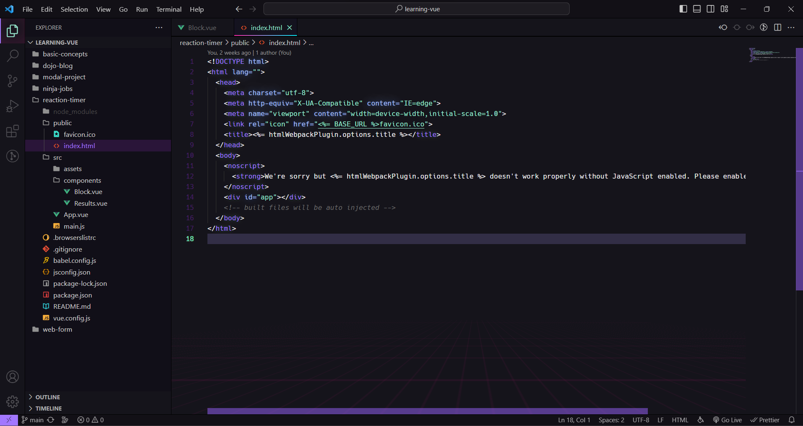

# My VS Code Theme

My Custom VS Code Theme inspired by Dalton Menezes' [Aura Theme](https://github.com/daltonmenezes/aura-theme)
and CodingPhase's [VS Code Style](https://github.com/codingphasedotcom/codingphase-style-vs-code).

### Sample Screenshot



### How to use

1. Open up a Terminal

2. Install vsce package

   `npm install -g vsce`

3. Package the theme

   `vsce package`

4. Install the theme

   `code --install-extension [name_of_packaged_theme].vsix`

   Example:

   `code --install-extension my-vscode-theme-0.0.1.vsix`

5. Install [Custom CSS and JS Loader](https://github.com/be5invis/vscode-custom-css)

6. Open up VS Code Settings JSON

   For Windows:

   `Ctrl + Shift + P > Open User Settings (JSON)`

7. Copy and paste these properties into the JSON file

   ```
   "vscode_custom_css.imports": [
   	"file:///[Drive]:/Users/[User]/.vscode/extensions/undefined_publisher.my-vscode-theme-0.0.1/myCustomStyles.css"
   ],

   "workbench.tree.indent": 20,
   "editor.cursorSmoothCaretAnimation": "on",
   "editor.cursorBlinking": "smooth",
   "editor.lineHeight": 1.5,
   "terminal.external.linuxExec": "iterm"
   ```

8. Reload Custom CSS and JS

   For Windows:

   `Ctrl + Shift + P > Reload Custom CSS and JS`
